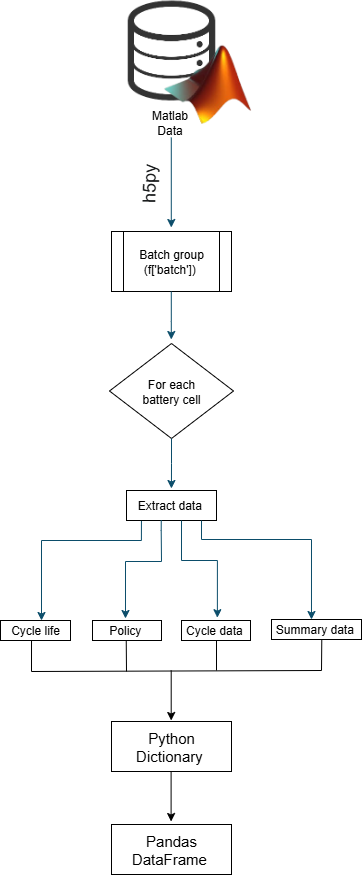

# Battery-Life-cycle-data-preparation- 

[View Interactive Plot](photo/battery_cycle_life_distribution.html)

# 📘 Overview

This repository contains data preparation and preprocessing scripts for the study of 124 commercial lithium-ion batteries (APR18650M1A) manufactured by A123 Systems.
The dataset is designed for exploring early-cycle degradation markers and battery cycle life prediction using machine learning and deep learning approaches.

The repository demonstrates how to convert complex hierarchical .mat files into structured and analysis-ready tabular datasets suitable for Python-based modeling workflows.

# 🔬 Dataset Description
# 🧪 Battery Specifications

* Cell Type: APR18650M1A (A123 Systems)

* Chemistry: Lithium Iron Phosphate (LFP) / Graphite

* Nominal Voltage: 3.3 V

* Nominal Capacity: 1.1 Ah

* Key [: Supports fast charging and high-rate discharging — ideal for life-cycle and degradation studies

⚙️ Experimental Setup

All experiments were conducted using 48-channel Arbin LBT potentiostats within a temperature-controlled chamber at 30 °C.

* Cells were mounted horizontally with Type T thermocouples attached using thermal epoxy and Kapton tape.

* Temperature, voltage, current, and internal resistance (IR) were measured continuously.

* IR measurements were taken at 80% SOC with ten ±3.6C pulses lasting 30–33 ms (depending on batch).

# 🧫 Experimental Batches

  | **Batch**   | **Date**   | **Charging Policy**       | **Notable Parameters**                                                                                                |
| :---------- | :--------- | :------------------------ | :-------------------------------------------------------------------------------------------------------------------- |
| **Batch 1** | 2017-05-12 | Single-step fast charging | 8–13.3 minute charging cycles (0–80% SOC) with 1-minute and 1-second rest times, C/50 CV cutoff, and 30 ms IR pulses. |
| **Batch 2** | 2017-06-30 | Re-tests of Batch 1 cells | Fixed 10-minute charge times, 5-minute rests, C/50 CV cutoff, and 30 ms IR pulses.                                    |
| **Batch 3** | 2018-04-12 | Two-step fast charging    | 10-minute fixed charge, four pauses of 5 seconds, C/20 CV limit, and 33 ms IR pulses, with 3–8 cells per rule.        |

# Data Preprocessing

