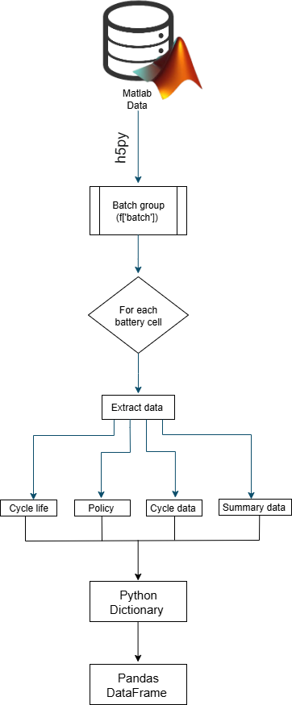

# lithium ion Battery Life cycle data preparation and Perform Machine Learning 

A Python-based data preparation and machine learning workflow for lithium-ion battery cycle life prediction.

---
## 🚀 Project Overview

This repository provides a complete pipeline for:

- Converting raw battery `.mat` files into structured datasets  
- Cleaning and preprocessing cycle data  
- Feature engineering for early degradation analysis  
- Training machine learning models for battery life prediction  

The main objective is to transform raw experimental battery data into machine-learning-ready datasets and benchmark predictive models.

----

## 📦 Dataset Description

The dataset includes information from **124 commercial lithium-ion cells (APR18650M1A)**.

**Cell Specifications:**

- **Cell Type:** APR18650M1A  
- **Chemistry:** Lithium Iron Phosphate (LFP) / Graphite  
- **Nominal Voltage:** 3.3 V  
- **Nominal Capacity:** 1.1 Ah

The original raw dataset used in this project is available here:

🔗 **Battery Dataset (Original Source)**  
[Data set](https://data.matr.io/1/projects/5c48dd2bc625d700019f3204)

This dataset contains raw lithium-ion battery cycling data including voltage, current, temperature, and resistance measurements.

The dataset contains time-series measurements including:

- Voltage  
- Current  
- Temperature  
- Internal resistance  
- Charge and discharge cycle data  

---

#  Experimental Setup

All experiments were conducted using 48-channel Arbin LBT potentiostats within a temperature-controlled chamber at 30 °C.

* Cells were mounted horizontally with Type T thermocouples attached using thermal epoxy and Kapton tape.

* Temperature, voltage, current, and internal resistance (IR) were measured continuously.

* IR measurements were taken at 80% SOC with ten ±3.6C pulses lasting 30–33 ms (depending on batch).

# Experimental Batches

  | **Batch**   | **Date**   | **Charging Policy**       | **Notable Parameters**                                                                                                |
| :---------- | :--------- | :------------------------ | :-------------------------------------------------------------------------------------------------------------------- |
| **Batch 1** | 2017-05-12 | Single-step fast charging | 8–13.3 minute charging cycles (0–80% SOC) with 1-minute and 1-second rest times, C/50 CV cutoff, and 30 ms IR pulses. |
| **Batch 2** | 2017-06-30 | Re-tests of Batch 1 cells | Fixed 10-minute charge times, 5-minute rests, C/50 CV cutoff, and 30 ms IR pulses.                                    |
| **Batch 3** | 2018-04-12 | Two-step fast charging    | 10-minute fixed charge, four pauses of 5 seconds, C/20 CV limit, and 33 ms IR pulses, with 3–8 cells per rule.        |

# Data Preprocessing

 The same extraction and cleaning procedure was applied to the rest of the batches, ensuring that each file was trans formed from its initial MATLAB format to a uniform tabular format. After processing all batches, the resulting DataFrames were combined into one unified dataset. This unified dataset not only combined measurements across different cells and batches but also delivered a uniform structure with each row
 a cycle and each column recording a particular feature of interest. Last but not least, the dataset was saved as a CSV file, thus being both light and convenient for subsequent statistical analysis, machine learning tasks, deep learning or long-term data storage.

 [the distribution of battery cycle life, highlighting failure](photo/battery_cycle_life_distribution.html)

# 📊 Created Dataset (Processed Version)

A cleaned and structured version of the dataset created from this preprocessing pipeline is available on Kaggle:

🔗 **Processed Dataset (Kaggle Version)**  
[Creat Dataset](https://www.kaggle.com/datasets/solitaryseeker/lithium-ion-battery-cycle-life-time-series-dataset)

This version includes:

- Structured tabular format  
- Cleaned cycle data  
- Machine-learning-ready features  
- CSV format for easy integration  

---

# Perform Machine Learning

| **Model**                     |  **MSE** | **RMSE** | **R² Score** |
| :---------------------------- | -------: | -------: | -----------: |
| **LightGBM Regressor**        | 1199.115 |   34.628 |        0.991 |
| **XGBoost Regressor**         | 1123.371 |   33.517 |        0.992 |
| **K-Nearest Neighbors (KNN)** |  271.087 |   16.465 |        0.998 |
| **Decision Tree Regressor**   | 5809.059 |   76.217 |        0.957 |
| **Random Forest Regressor**   | 4554.930 |   67.490 |        0.966 |

## 🤝 Contributing

Contributions are welcome!

You can contribute by:

- Improving feature engineering
- Adding new ML models
- Enhancing preprocessing scripts
- Improving documentation

Please open an issue or submit a pull request.

---

## 👤 Author

**Rohit Sahu**  
Machine Learning & NLP Enthusiast  

📧 Email: quantumsolitaryseeker@gmail.com  

🔗 LinkedIn: https://www.linkedin.com/in/rohit-sahu-7142742a7/

🐙 GitHub: https://github.com/Solitaryseeker

---

